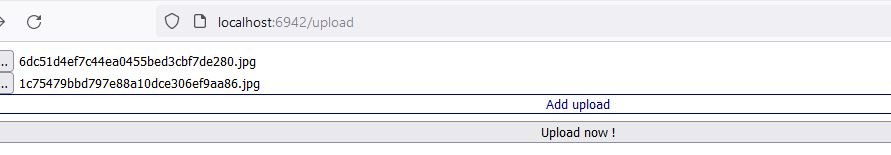

<p align="center">
<b align="center" style="font-size: 4em;"> 👝 </b><br />
<b>fpouch</b><br /> 0.0.1 <br /> Minimalist file sharing and upload server.
</p>

### How to use

Simple file server:

```
./fpouch -store-path ./media
```

Without `-store-path` it will store file in current working directory. If the `store-path` supplied, but the folder doesn't exist it will created. 

It will start at `localhost:6942`:
- `/upload`, upload file.

- `/index`, shared files.

- `/*`, endpoint of file, `/uwu.png` to get the files.


Setup only for upload option:

```
./fpouch -no-sharing
```

Run only for sharing option:

```
./fpouch -no-upload
```

No UI option, you may direct upload from endpoint (e.g using CURL) and sharing index in JSON format.

```
./fpouch -no-ui
```

Change port:

```
./fpouch -port 6969
```

### License

[UNLICENSE](./UNLICENSE)